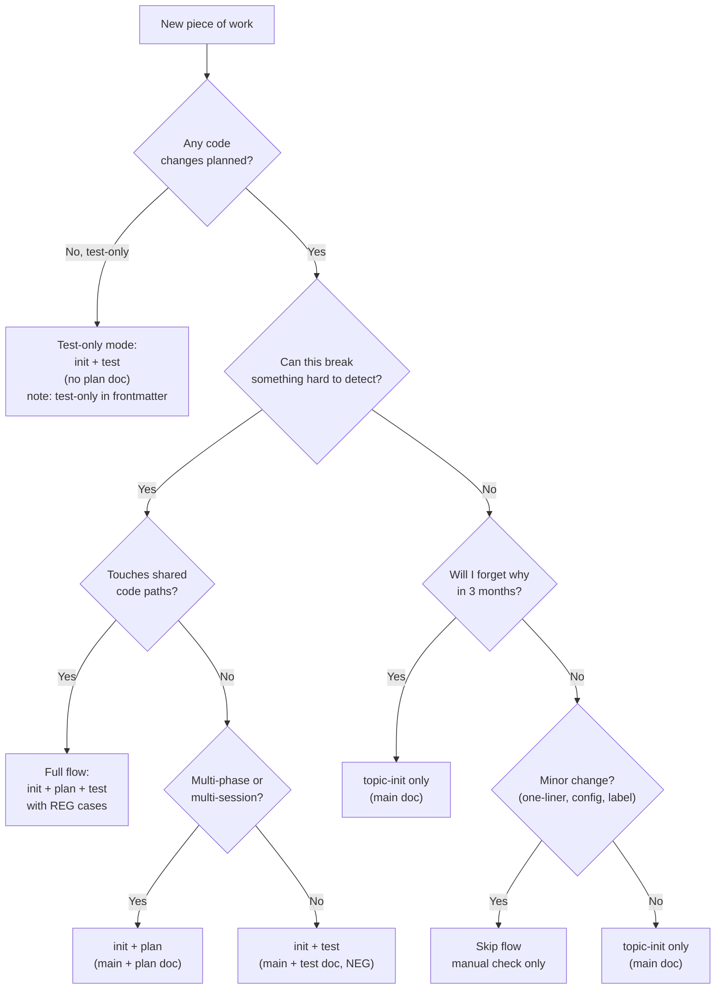

# Topic Workflow Guide — Dynamic Flow Selection

**Status:** Active
**Last Updated:** 2026-08-20 (added Plan Doc Verify node)

> *Adapt paths/commands to your repository's actual layout and tooling. Topic docs follow the `docs/ref/<MODULE>/<TOPIC>/` convention described below — keep that convention, but adapt directory names, commands, and environment details to the adopting repo.*

---

## Table of Contents

1. [Overview](#overview)
2. [Terminology — the Workflow as a State Graph](#terminology--the-workflow-as-a-state-graph)
3. [The Topic Skills at a Glance](#the-topic-skills-at-a-glance)
4. [The Full Flow — When Every Step Matters](#the-full-flow--when-every-step-matters)
5. [Scaling Down — Practical Guidance by Case](#scaling-down--practical-guidance-by-case)
6. [The Real Questions to Ask](#the-real-questions-to-ask)
7. [Staging Post-Deploy Verification](#staging-post-deploy-verification)
8. [Rules, Hooks & Gates Reference](#rules-hooks--gates-reference)
9. [Decision Matrix](#decision-matrix)
10. [Templates Reference](#templates-reference)
11. [Conciseness Review](#conciseness-review)
12. [Main Doc Verify](#main-doc-verify)
13. [Plan Doc Verify](#plan-doc-verify)
14. [Branch & Commit Strategy](#branch--commit-strategy)
15. [Workflow Self-Correction](#workflow-self-correction)

---

## Overview

This guide explains how to **dynamically select the right depth** of the topic documentation workflow based on the nature, risk, and complexity of the work. The topic skills (`topic-init`, `topic-plan`, `topic-test`, and any verification/meta nodes) are a **toolkit, not a rigid mandate** — they scale up and down depending on what you're doing.

The skills themselves are designed so that **every piece of work** — feature, bugfix, investigation, minor change — is called a "topic" and follows the same general pattern. But applying the full topic-doc flow with all gates to a one-line config fix is over-engineering. This guide helps you decide **which parts to use and which to skip**.

**Key principle:** *Scale the flow to the risk, not the flow to the label.*

**Classification is built into `topic-init`** — Step 1 of `topic-init` classifies the topic first (per [Shared: Topic Classification](`${CLAUDE_PLUGIN_ROOT}/skills/_shared/rules/topic-classification.md`)) and determines which downstream skills are needed. For minor changes, `topic-init` stops before writing any doc. The classification is recorded in the main doc frontmatter so the AI model and the user are always aware of the chosen flow.

---

## Terminology — the Workflow as a State Graph

This workflow is modeled as a **state graph**: **nodes** (the discrete steps of the workflow) connected by **edges** (the conditional transitions between them). New nodes are added from time to time to improve the workflow, so the graph is **dynamic, not fixed** — node counts and names are intentionally **generic** in prose so a new node needs only the canonical lists updated, not every doc.

### The core terms

| Term | Meaning | Example |
|------|---------|---------|
| **Node** | A discrete step in the workflow graph — a skill, agent, or hook that does one job | `topic-init`, `main-doc-verify`, `workflow-self-correct` |
| **Edge** | A conditional transition between nodes (e.g. "if minor change → skip docs", "if verify passes → human review") | `topic-init → main-doc-verify → topic-plan` |
| **Skill** | A Claude Code slash-command procedure (`${CLAUDE_PLUGIN_ROOT}/skills/<name>/SKILL.md`) — the canonical, detailed procedure | `/topic-init`, `/main-doc-verify` |
| **Agent** | A VS Code Copilot custom agent (`.github/agents/<name>.agent.md`, if the adopting repo uses one) — the **same procedure** as the skill, invoked differently | `topic-init` agent, `main-doc-verify` agent |
| **Rule** | A shared or per-skill rule file (`${CLAUDE_PLUGIN_ROOT}/skills/**/rules/*.md`) that the skill/agent follows | `topic-main-doc-writing.md`, `topic-doc-writing-conventions.md` |
| **Hook** | A deterministic (no-LLM) gate/transform that mechanically enforces a rule — such gates may exist in the adopting repo's `.claude/hooks/` (check before relying on them) | `toc-sync`, `doc-reference-gate`, `secret-scan` |
| **Template** | A first-time-write skeleton (`${CLAUDE_PLUGIN_ROOT}/skills/<name>/templates/*.md`) | `main-doc.md`, `plan-doc.md`, `test-doc.md` |

### Claude Code vs VS Code — same concept, different harness

The workflow has **two equivalent drivers** — they are the *same nodes* expressed in each harness's native mechanism, with **no duplication**:

| Concept | Claude Code | VS Code Copilot |
|---------|-------------|-----------------|
| A node's procedure | **Skill** (`${CLAUDE_PLUGIN_ROOT}/skills/<name>/SKILL.md`) — invoked as `/skill-name` | **Agent** (`.github/agents/<name>.agent.md`) — invoked as a custom agent |
| Source of truth | The SKILL.md is the canonical procedure | The agent **reads the same SKILL.md** as its source of truth |
| Deterministic enforcement | Native `PostToolUse` hooks | The Hook Watcher VS Code task + on-save backstop (same `runForFile` logic) |

**Key point:** a skill and its agent are **not two different nodes** — they are **one node** (one procedure) with two invocation surfaces. The agent file is a thin wrapper that points at the skill's SKILL.md. This is why the docs say "no duplication": the procedure lives once (in the skill), and the agent references it.

**Why this matters:** when you read "node", "skill", or "agent" in this guide, they refer to the same underlying workflow step — the term depends on which harness is being discussed. The graph itself (nodes + edges) is harness-agnostic.

---

## The Topic Skills at a Glance

| Skill | Command | Doc Produced | Owns | Purpose |
|-------|---------|-------------|------|---------|
| `topic-init` | `/topic-init <module> <topic>` | Main doc (`<PREFIX>.md`) | What & Why | Records current state, target state, technical details, requirements, open questions |
| `topic-plan` | `/topic-plan <module> <topic>` | Plan doc (`<PREFIX>_PLAN.md`) | How | Phases, steps, branch/commits, deployment status, progress tracker, risks, rollback |
| `topic-test` | `/topic-test <module> <topic>` | Test doc (`<PREFIX>_TEST.md`) | How to Verify | Test environment, test cases (SMK/NEG/TC + optional), execution flow, pass criteria |
| `topic-status` | `/topic-status <module> <topic>` | (none — read-only) | Where are we | Reads the topic docs and reports the workflow position + next step. Use at the start of a new session to recover your place without reading multiple docs |
| `main-doc-verify` | `/main-doc-verify <path>` | (verifies the main doc) | Verify | Verifies the main doc for correctness, reliability, and accuracy vs current code — requirements cited, external claims sourced, no invented metrics, structural rules. Optional, encouraged before the human review checkpoint |
| `plan-doc-verify` | `/plan-doc-verify <path>` | (verifies the plan doc) | Verify | Verifies the plan doc for correctness, completeness, and soundness vs current code — requirements fully covered & traceable, coding-standards conformance (feature layering, error handling, logging, reuse/anti-spaghetti), design-level security/OWASP, accuracy vs code, rollback, NFR coverage, phasing sanity, branch & commit hygiene. Optional, encouraged before the human review checkpoint |
| `workflow-self-correct` | `/workflow-self-correct <target>` | (edits skills/rules/templates/docs) | Meta — the workflow itself | Detects and fixes redundancy/duplication across the topic-doc ecosystem; consolidates universal rules into `_shared/rules/`; replaces duplicated content with references |

### Dependencies Between Skills

```text
topic-status  ←  (run at any point to check where you are)
     │
     ↓
topic-init  →  [main-doc-verify]  →  topic-plan  →  [plan-doc-verify]  →  topic-test
 (main doc)     (optional verify)     (plan doc)     (optional verify)      (test doc)
     │                                  ↑
     └──────────────────────────────────┘
           test-only mode
        (skip plan, no code changes)
```

- `topic-plan` **requires** the main doc to exist (created by `topic-init`).
- `topic-test` **requires** the main doc to exist. The plan doc is **required when code changes are planned**, but **optional in test-only mode** (testing an existing feature with no code changes — e.g. audit, regression validation, baseline characterization).
- `main-doc-verify` is **optional** — `topic-init` Step 4 encourages running it before the human review checkpoint, but it never blocks. It verifies the main doc for correctness, reliability, and accuracy vs current code.
- `plan-doc-verify` is **optional** — `topic-plan` Step 5.3 encourages running it before the human review checkpoint, but it never blocks. It verifies the plan doc for correctness, completeness, and soundness vs current code (requirements coverage, coding standards, design-level security/OWASP, accuracy, rollback, NFR coverage, phasing, branch & commit hygiene).
- `topic-status` is a **read-only** node — it can be run at any point to check where the topic is and what the next step is. It reads the topic docs and reports the workflow position + next step + model recommendation. Use it at the start of a new session to recover your place without reading multiple docs manually.
- Each skill is designed to be run **in its own separate session/prompt** to avoid context dilution.
- Every topic skill ends with a **mandatory session & model reminder** step that tells the human to start a fresh session and select the right model for the next task. This is non-blocking but mandatory — the AI must always say it.

---

## The Full Flow — When Every Step Matters

For **new features, complex bug fixes, or work touching shared code paths**, use the complete flow:

```mermaid
flowchart TD
    S["0. /topic-status — Session entry point<br/>Read docs → report where you are + next step + model<br/>Run this at the start of every new session"] --> A["1. /topic-init — Step 1: Classify<br/>Ask the 7 classification questions<br/>determine case & recommended flow"]
    A --> A1{"Classification result"}
    A1 -->|"Minor change"| SkipFlow["Stop — no doc written<br/>make change manually"]
    A1 -->|"All other cases"| B["1. /topic-init — Steps 2–3<br/>Explore codebase → Write Main Doc<br/>(classification recorded in frontmatter)<br/>+ Run Hook Watcher (if present)"]
    B --> C["2. /topic-plan<br/>Read main doc → Explore deeper → Write Plan Doc<br/>(phases, steps, branch, risks, rollback)"]
    C --> D["Resolve all Open Questions<br/>(gate: must be resolved before execution)"]
    D --> E["3. /topic-test<br/>Read main + plan → Explore → Write Test Doc<br/>(SMK, NEG, TC, optional categories)"]
    E --> F["4. Run Smoke & Sanity<br/>(baseline health check)"]
    F --> G["5. Run NEG tests BEFORE fix<br/>(capture the bug/original behavior)"]
    G --> H["6. Implement code changes — ALL phases<br/>(start from Phase 0 — per-phase-per-prompt<br/>is a complexity-based recommendation,<br/>not a mandate; human decides granularity.<br/>Do NOT run tests between phases —<br/>complete ALL phases first)"]
    H --> H2["6b. Update Progress Tracker<br/>(mark completed phase ✅ before<br/>starting the next phase)"]
    H2 --> H3["6c. Run full unit-test suite (UNIT)<br/>— recommended, after ALL phases,<br/>before NEG post-fix. Infrastructure-free<br/>(mocked dependencies — no DB/cache/server).<br/>Do NOT run between phases."]
    H3 --> I["7. Re-run NEG tests AFTER fix<br/>(confirm correct rejection)"]
    I --> J["8. Run Positive tests<br/>(confirm happy paths)"]
    J --> K["9. Deploy<br/>Working Branch → DEV → STG → PRD"]
    K --> K2["9b. Staging Post-Deploy Verification<br/>(run STG- cases against the staging gateway<br/>— required for Feature / Bug fix /<br/>Config-infra / Hotfix, optional otherwise)"]
    K2 --> L["10. Update Docs<br/>(test doc results, plan doc progress, deployment status)"]
```



### Guardrails in the full flow

| Checkpoint | Rule | Enforced By |
|-----------|------|-------------|
| Requirements gate | Main doc §2 is mandatory & blocking — no requirement source = stop | `topic-init` skill rule |
| Open Questions gate | All open questions in plan doc must be `✅ Resolved` before execution or test doc | Deterministic gate if present (e.g. `check-open-questions-gate.js` in `.claude/hooks/` — check before relying on it); otherwise LLM-enforced |
| Negative-flow-before-fix | NEG cases run before AND after the fix — one result line is incomplete | Deterministic gate if present (e.g. `check-neg-flow-gate.js` — check before relying on it); otherwise LLM-enforced |
| Regression gate | REG cases required when shared code paths are touched | Deterministic gate if present (e.g. `check-regression-gate.js` — check before relying on it); otherwise LLM-enforced |
| TOC sync | Table of Contents must match section headings | Deterministic gate if present (e.g. `check-toc-sync.js` — check before relying on it); otherwise LLM-enforced |
| Env scope | Never store real connection info in test doc — placeholders only (the `<UPPER_SNAKE_CASE>` placeholder convention, e.g. `<LOCAL_API_URL>`) | Deterministic gate if present (e.g. `check-env-scope.js` — check before relying on it); otherwise LLM-enforced |
| Staging post-deploy verification | When the plan doc marks STG as Deployed, the test doc must include a `STG-` section with the staging-runnable cases and their post-deploy results | `topic-test` rule (LLM-enforced) — no deterministic gate in the plugin |
| One skill per session | Prefer separate sessions for init → plan → test | Skill recommendation |
| Per-prompt discipline | Within a session, send one prompt at a time — do not chain unrelated requests | `${CLAUDE_PLUGIN_ROOT}/skills/_shared/rules/topic-doc-writing-conventions.md` |
| Post-task session reminder | Every topic skill's final step must remind the human to start a fresh session for the next skill/phase | Mandatory in `topic-init`, `topic-plan`, `topic-test` Confirm steps |
| Post-task model reminder | Every topic skill's final step must remind the human to select the right model for the next task | Mandatory in `topic-init`, `topic-plan`, `topic-test` Confirm steps — see model table in `AI_ASSISTED_DEVELOPMENT_PRINCIPLES.md` §11 |
| Progress Tracker sync | After completing each implementation phase, mark it ✅ in the plan doc's Progress Tracker before starting the next phase — so `topic-status` reads accurate data | `topic-plan` Step 5.2 rule (LLM-enforced) — no deterministic gate in the plugin |
| No tests between phases | Complete ALL implementation phases before running any post-implementation tests (NEG post-fix, Positive, REG, and the full unit-test suite). The only tests before implementation are SMK and NEG pre-fix. Do not run tests between phases. The full-suite unit run (e.g. `npm test`) is a **single post-implementation gate that runs after ALL phases** — not a per-phase check — so it does not contradict this rule. | Adopting-repo `AGENTS.md` (if present) principle 4; `topic-plan` Step 6 rule |
| Unit-test gate (recommended) | When a plan phase touches function-level logic in service/helper/util layers (e.g. `server/database/service/`, `server/helpers/`, `server/utils/`, or `server/service/` in an Express.js-style backend — *adapt to your repo*), run the full unit-test suite once (e.g. `npm test`), after ALL implementation phases and before the NEG post-fix pass. Infrastructure-free (mocked dependencies — no DB/cache/server). Recommended, not gating. Skip for pure endpoint/doc/config-only changes. | `topic-test` rule (LLM-enforced) — no deterministic gate in the plugin |
| Session entry point | Run `topic-status` at the start of every new session to recover your place without reading multiple docs | `topic-status` skill (read-only) |

---

## Scaling Down — Practical Guidance by Case

The full flow is not always the right flow. Use this table to decide how much process to apply:

| Case | What to Use | What to Skip | Why |
|------|-------------|-------------|-----|
| **New feature (heavy)** | ✅ Full flow — all topic docs, all gates, all required test categories | Nothing | High risk, high complexity, requires full traceability from requirement to deployment |
| **Bug fix (non-trivial)** | ⚠️ `topic-init` (main doc) + `topic-test` (test doc with NEG before/after). Plan doc optional — use if the fix spans multiple files or phases | Plan doc if straightforward; optional test categories (EC, ERR, PERF) | NEG-before-fix is the highest-value part for bug fixes — it proves the bug existed and the fix resolved it |
| **Minor change** (config value, label text, one-liner) | ❌ Skip the flow entirely — make the change, run a quick manual check | All topic docs | Documentation overhead exceeds the work itself. Just make the change and verify manually |
| **Investigation & code check** | ✅ `topic-init` only — the main doc's Current State + Open Questions sections are exactly what an investigation needs | Plan doc and test doc — unless the investigation leads to a code change | The main doc is the natural output of an investigation: document what you found, what's unclear, what needs deciding |
| **Refactor (no behavior change)** | ⚠️ `topic-init` (main doc) + `topic-test` (test doc with REG cases). Plan doc optional | NEG/POS if no behavior change; plan doc if refactor is straightforward | Regression testing is the critical part — proves no behavior changed. The main doc records what was refactored and why |
| **Config/infra change with risk** (e.g. cache key schema, new env var) | ⚠️ `topic-init` + `topic-test` (SMK + NEG). Plan doc if the change is complex | Optional test categories | You need to verify the service still boots (SMK) and that the old config behavior is correctly replaced (NEG) |
| **Hotfix (production incident)** | ⚠️ Fix first, then `topic-init` retroactively to document what happened and why. `topic-test` for regression | Plan doc (the fix is already done — plan would be fiction) | In an incident, fix first. But still document afterward so the incident is traceable |
| **Test-only (existing feature audit)** | ✅ `topic-init` + `topic-test` (test-only mode — no plan doc needed) | Plan doc — there are no code changes, no phases, no branch, no rollback | Testing an existing feature with no code changes. The plan doc would be pure fiction. `topic-test` operates in test-only mode, deriving test targets from the main doc + codebase directly |

---

## The Real Questions to Ask

Instead of asking "is this a bugfix or a feature?", ask these questions to determine how much process to apply:

### 1. Can this break something I can't easily detect?

- **Yes** → At minimum, write NEG test cases before touching code. The test doc (`topic-test`) is your safety net.
- **No** → You can likely skip the full flow. A manual check may suffice.

### 2. Will I forget why I did this in 3 months?

- **Yes** → At minimum, write the main doc (`topic-init`). Its Current State, Target State, and Requirements sections create the traceability record.
- **No** → If the change is self-explanatory and low-risk, skip the docs.

### 3. Does this touch shared code paths?

Shared code paths = shared middleware/helper/util/config directories (e.g. `server/middleware/`, `server/helpers/`, `server/utils/`, `config/` in an Express.js-style backend — *adapt to your repo's layout*), or any file imported by 2+ modules.

- **Yes** → Write the main doc + test doc with **REG (regression) cases**. The regression gate (if present in the adopting repo's `.claude/hooks/`) will enforce this. This is where silent breakage happens.
- **No** → Regression testing is optional. Focus on the specific module's behavior.

### 4. Is the requirement unclear or could it change?

- **Yes** → The Requirements gate in `topic-init` is valuable — it forces you to cite the source and state the type before writing anything. This catches contradictions early.
- **No** → If the requirement is crystal clear and stable, the main doc is still useful but less critical.

### 5. Is this a multi-phase effort spanning multiple sessions?

- **Yes** → The plan doc (`topic-plan`) is essential — its Progress Tracker and phase breakdown keep you oriented across sessions and prevent context loss.
- **No** → If it's a single-session change, the plan doc is overhead.

### 6. Am I likely to context-switch or get interrupted?

- **Yes** → Write at least the main doc. It serves as a recovery point — you can re-read it to pick up where you left off.
- **No** → If you can complete it in one uninterrupted session, less documentation is needed.

### 7. Is this a test-only audit of an existing feature?

- **Yes** → Use `topic-init` (main doc) + `topic-test` (test-only mode). Skip `topic-plan` entirely — there are no code changes, so there's nothing to plan. The test doc derives test targets from the main doc and codebase directly. Note `Mode: test-only (no plan doc)` in the test doc frontmatter.
- **No** → Continue to the other questions above.

### Decision Tree



---

## Staging Post-Deploy Verification

**What it is:** After a topic is deployed to Staging (STG), the test doc's staging-runnable cases are executed against the staging environment (via the staging API gateway — e.g. a gateway prefix such as `/cr`; *adapt the gateway path to your environment*) and the results are recorded. This is the **pre-prod validation** that the change actually works in a deployed environment — not just on a developer's machine.

**Why it matters:** Local testing proves the code works in isolation. Staging testing proves it works behind the real API gateway, with the real staging config, staging databases/cache, and the staging network path. Some issues only surface in staging (gateway routing, gateway prefix, staging env vars, staging DB prefixes, custom auth headers — e.g. an `X-User-Role`-style role header).

**When it is required vs optional** (see the Decision Matrix):

| Classification | Staging post-deploy verification |
|----------------|---------------------------------|
| New feature (heavy) | ✅ **Required** |
| Bug fix (non-trivial) | ✅ **Required** |
| Config/infra change | ✅ **Required** (at minimum SMK on staging) |
| Hotfix (incident) | ✅ **Required** (at minimum REG on staging) |
| Refactor | ⚠️ Optional |
| Test-only (existing feature audit) | ⚠️ Optional |
| Investigation | ❌ Skip |
| Minor change | ❌ Skip |

**How it's recorded:** The test doc includes a `## Staging Post-Deploy Verification` section with `STG-###` cases. Each case targets the staging URL explicitly (`<STG_GATEWAY_URL>/<gateway-prefix>/api/...` — placeholders use the `<UPPER_SNAKE_CASE>` convention; e.g. `<STG_GATEWAY_URL>/cr/api/...` in an environment that routes through a `/cr` prefix — plus any required auth headers, e.g. `X-User-Role`) and records a `**Result:**` line after the staging run. The plan doc's Deployment Status table marks STG as Deployed, which is the trigger to run these cases.

**Enforcement:** This is currently **LLM-enforced** (a `topic-test` rule) — there is **no deterministic gate** for it in the plugin. The `topic-test` skill instructs the model to generate the `STG-` section when the classification requires it and the topic is deployed to STG. If you want a mechanical backstop later, add a `check-staging-gate.js` hook to the adopting repo's `.claude/hooks/` (mirroring the regression gate) that reads the plan doc's Deployment Status and requires a `STG-` section when STG is Deployed.

---

## Rules, Hooks & Gates Reference

The skills can be backed by deterministic hooks (JavaScript) in the adopting repo's `.claude/hooks/` that enforce specific rules regardless of which agent or human is editing. These are the **backstop** — the skills instruct the LLM to follow rules, but hooks catch violations mechanically. **Check whether these gates exist in the adopting repo before relying on them**; where they are absent, the corresponding rules remain LLM-enforced (best-effort).

### Hooks

| Hook | File | What It Checks | When It Runs |
|------|------|---------------|-------------|
| TOC sync | `check-toc-sync.js` | Table of Contents matches all `##` and key `###` headings | On every doc save |
| Open questions gate | `check-open-questions-gate.js` | All open questions in plan doc are `✅ Resolved` before execution or test doc creation | On plan doc save |
| Negative flow gate | `check-neg-flow-gate.js` | NEG test cases have both `Result (pre-fix)` and `Result (post-fix)` recorded | On test doc save |
| Regression gate | `check-regression-gate.js` | REG test cases exist when shared code paths are touched | On test doc save |
| Env scope | `check-env-scope.js` | No real connection info (URLs, hosts, ports, credentials) in test doc — placeholders only | On test doc save |

*These are the reference hook set shipped with this workflow; an adopting repo may install a subset. The files live under `.claude/hooks/` if present (adapt as needed).*

### Running the Hook Watcher

If the adopting repo has the hooks installed, the Hook Watcher runs continuously in the background, checking `docs/ref/**/*.md` on every save:

- **VS Code task:** a `👁 Run Hook Watcher` task (named per the adopting repo, e.g. `👁 Run Hook Watcher — <RepoName>`)
- **Manual:** `node .claude/hooks/run-watchers.js` (if present)

Recommend running this whenever you're actively editing topic docs — it catches drift that an LLM pass could miss.

### Shared Rules

| Rule File | Location | Used By |
|-----------|----------|---------|
| `topic-classification.md` | `${CLAUDE_PLUGIN_ROOT}/skills/_shared/rules/` | `topic-init` Step 1 — classification questions, 7 cases, flow mapping, frontmatter recording |
| `locate-topic.md` | `${CLAUDE_PLUGIN_ROOT}/skills/_shared/rules/` | All topic skills — name resolution priority order & path derivation |
| `topic-path-derivation.md` | `${CLAUDE_PLUGIN_ROOT}/skills/_shared/rules/` | All topic skills — `<MODULE>`, `<TOPIC>`, `<PREFIX>` derivation |
| `topic-doc-writing-conventions.md` | `${CLAUDE_PLUGIN_ROOT}/skills/_shared/rules/` | All topic skills — TOC, Last Updated, file paths, never guess, cross-linking |

### Per-Skill Rules

| Skill | Rule File | Key Rules |
|-------|-----------|-----------|
| `topic-init` | `${CLAUDE_PLUGIN_ROOT}/skills/topic-init/rules/topic-main-doc-writing.md` | Requirements section mandatory & blocking; §5.5 NFR required for Features; TOC rules; update on edit |
| `topic-plan` | `${CLAUDE_PLUGIN_ROOT}/skills/topic-plan/rules/topic-plan-doc-writing.md` | Reuse existing code (grep before specifying new); Open Questions required section; Requirement Coverage required table; TOC + Last Updated on every edit |
| `topic-test` | `${CLAUDE_PLUGIN_ROOT}/skills/topic-test/rules/topic-test-doc-writing.md` | Required/optional category gating; NEG-before-fix rule; env placeholder policy; post-test-run updates; regression conditional requirement |

---

## Decision Matrix

| | `topic-init` (main doc) | `topic-plan` (plan doc) | `topic-test` (test doc) | SMK | NEG before | NEG after | TC | UNIT | REG | EC/ERR/PERF | STG post-deploy |
|---|---|---|---|---|---|---|---|---|---|---|---|
| **New feature (heavy)** | ✅ | ✅ | ✅ | ✅ | ✅ | ✅ | ✅ | ⚠️ if logic touched | ✅ if shared | Optional | ✅ Required |
| **Bug fix (non-trivial)** | ✅ | ⚠️ if multi-file | ✅ | ✅ | ✅ | ✅ | ✅ | ⚠️ if logic touched | ✅ if shared | Optional | ✅ Required |
| **Minor change** | ❌ | ❌ | ❌ | ❌ | ❌ | ❌ | ❌ | ❌ | ❌ | ❌ | ❌ |
| **Investigation** | ✅ | ❌ | ❌ | ❌ | ❌ | ❌ | ❌ | ❌ | ❌ | ❌ | ❌ |
| **Refactor** | ✅ | ⚠️ if complex | ✅ | ✅ | ❌ | ❌ | ❌ | ⚠️ if logic touched | ✅ | Optional | ⚠️ Optional |
| **Config/infra change** | ✅ | ⚠️ if complex | ✅ | ✅ | ✅ | ✅ | ⚠️ | ⚠️ if logic touched | ✅ if shared | Optional | ✅ Required (SMK) |
| **Hotfix (incident)** | Retroactive | ❌ | ✅ | ✅ | N/A | ✅ | ✅ | ⚠️ if logic touched | ✅ if shared | Optional | ✅ Required (REG) |
| **Test-only (existing feature audit)** | ✅ | ❌ | ✅ | ✅ | N/A | N/A | ✅ | ❌ | ✅ if shared | Optional | ⚠️ Optional |

Legend: ✅ = Required | ⚠️ = Conditional | ❌ = Skip

**`UNIT` column note:** ⚠️ means **recommended** (not required/gating) — generate `UNIT-###` cases when a plan phase touches function-level logic in service/helper/util layers (e.g. `server/database/service/`, `server/helpers/`, `server/utils/`, or `server/service/` in an Express.js-style backend — *adapt to your repo*); skip for pure endpoint/doc/config-only changes. The full unit-test suite (e.g. `npm test`) runs **after ALL implementation phases** and **before the NEG post-fix pass** (see the execution flow and `${CLAUDE_PLUGIN_ROOT}/skills/topic-test/rules/topic-test-doc-writing.md`). This is LLM-enforced — no deterministic gate in the plugin.

---

## Templates Reference

Each skill has its own template. Templates are only used on first-time write — updates are always targeted edits, never wholesale rewrites.

| Template | Location | When Used |
|----------|----------|-----------|
| Main doc template | `${CLAUDE_PLUGIN_ROOT}/skills/topic-init/templates/main-doc.md` | First-time `topic-init` write |
| Plan doc template | `${CLAUDE_PLUGIN_ROOT}/skills/topic-plan/templates/plan-doc.md` | First-time `topic-plan` write |
| Test doc template | `${CLAUDE_PLUGIN_ROOT}/skills/topic-test/templates/test-doc.md` | First-time `topic-test` write |

### `topic-init` — what the template produces

- Frontmatter (status, last updated)
- Table of Contents
- §1 Current State
- §2 Requirements (mandatory, blocking — source + type + statement)
- §3 Target State
- §4 Technical Details
- §5 Non-Functional Requirements (required for Feature type)
- §6 Open Questions

### `topic-plan` — what the template produces

- Frontmatter (status, last updated)
- Table of Contents
- Branch & Commits (working branch, commit messages in Conventional Commits format)
- Deployment Status table (Working Branch → DEV → STG → PRD)
- Progress Tracker (Phase 0 → Phase N → Final Phase)
- Requirement Coverage table (requirement → phase(s) → test case ID(s))
- Prerequisites
- Phases (Goal / Current Code / Reuse / Steps / Done When / Rollback)
- Risks (Likelihood / Impact / Mitigation)
- Open Questions (required — all must be resolved before execution)
- References

### `topic-test` — what the template produces

- Frontmatter (status, last updated)
- Table of Contents
- Test Environment (Local + Staging subsections, all connection info as placeholders — the `<UPPER_SNAKE_CASE>` convention, e.g. `<LOCAL_API_URL>`, `<LOCAL_DB_HOST>`, `<STG_GATEWAY_URL>`)
- Test Cases — Smoke & Sanity (required, run first)
- Test Cases — Negative Flow (required, run before AND after fix)
- Test Cases — Positive Flow (required, run after fix)
- Test Cases — Edge Cases (optional, on request)
- Test Cases — Error Scenarios (optional, on request)
- Test Cases — Regression (conditionally required — shared code paths)
- Test Cases — Performance (optional, on request)
- Testing Flow (execution order)
- Run Log (append-only, never edit prior entries)
- References

---

## Conciseness Review

After writing or updating any topic doc, the `doc-conciseness-review` skill can tighten the prose. `topic-init` always asks whether to run it after creating the main doc. Use it whenever a doc feels wordy or has grown through multiple edits.

- **Command:** `/doc-conciseness-review <path-to-doc.md>`
- **Skill file:** `${CLAUDE_PLUGIN_ROOT}/skills/doc-conciseness-review/SKILL.md`

---

## Main Doc Verify

The `main-doc-verify` node is the **verification pass** for the main doc. `topic-init` writes the main doc from codebase findings, but rule-following there is LLM-enforced (best-effort). This node re-checks every LLM-enforced rule against the actual codebase and the doc's own claims, so the human review checkpoint is backed by a verified document.

It is **main-doc specific** — plan and test docs have their own concerns (implementation detail, security/OWASP for plan docs) and are verified by their own future nodes.

- **Command:** `/main-doc-verify <path-to-main-doc.md>`
- **Skill file:** `${CLAUDE_PLUGIN_ROOT}/skills/main-doc-verify/SKILL.md`
- **Rule file:** `${CLAUDE_PLUGIN_ROOT}/skills/main-doc-verify/rules/main-doc-verify.md`
- **VS Code agent:** `.github/agents/main-doc-verify.agent.md` (if the adopting repo uses Copilot custom agents)

**What it verifies:**

| # | Check | Source rule |
|---|-------|-------------|
| 1 | Requirements §2 — source cited, type valid, statement precise | `${CLAUDE_PLUGIN_ROOT}/skills/topic-init/rules/topic-main-doc-writing.md` |
| 2 | External claims (pricing/quota/SLA) — each has source + URL + date checked, or `[UNVERIFIED — needs source]` | Adopting-repo `AGENTS.md` doc standard (if present) |
| 3 | No invented metrics — no unverified %/latency/cost numbers stated as fact | `${CLAUDE_PLUGIN_ROOT}/skills/topic-init/rules/topic-main-doc-writing.md` |
| 4 | Accuracy vs current code — file paths, functions, endpoints, DB/collection names match source | Adopting-repo `AGENTS.md` "docs can drift" guidance (if present) |
| 5 | Structural — no code blocks, no files-to-modify, §5.5 NFR present, OQ table format | `${CLAUDE_PLUGIN_ROOT}/skills/topic-init/rules/topic-main-doc-writing.md` |
| 6 | Deterministic gates (TOC, doc-reference, secret-scan) — reference, don't re-run (check whether the adopting repo's `.claude/hooks/` has them) | Hooks |

**When to use it:** `topic-init` Step 4 encourages running it before the human review checkpoint (optional, non-blocking). Also use it to re-verify a main doc after edits.

---

## Plan Doc Verify

The `plan-doc-verify` node is the **verification pass** for the plan doc — the plan-doc counterpart to `main-doc-verify`. `topic-plan` writes the plan doc from codebase findings, but rule-following there is LLM-enforced (best-effort). This node re-checks every LLM-enforced rule against the actual codebase, the main doc, and the adopting repo's coding conventions (from `AGENTS.md`, if present), so the human review checkpoint in `topic-plan` is backed by a verified plan.

It is **plan-doc specific** — main docs are verified by `main-doc-verify`; test docs have their own concerns and are verified by their own future node.

- **Command:** `/plan-doc-verify <path-to-plan-doc.md>`
- **Skill file:** `${CLAUDE_PLUGIN_ROOT}/skills/plan-doc-verify/SKILL.md`
- **Rule file:** `${CLAUDE_PLUGIN_ROOT}/skills/plan-doc-verify/rules/plan-doc-verify.md`
- **VS Code agent:** `.github/agents/plan-doc-verify.agent.md` (if the adopting repo uses Copilot custom agents)

**What it verifies:**

| # | Check | Source rule |
|---|-------|-------------|
| 1 | Requirements met & valid delivery — every §2.1 requirement maps to ≥1 phase AND ≥1 test case; phases collectively deliver the Target State | `${CLAUDE_PLUGIN_ROOT}/skills/topic-plan/rules/topic-plan-doc-writing.md` (Requirement Coverage) |
| 2 | Coding standards conformance — feature layering (e.g. endpoint → controller → service in an Express.js app), error-handling pattern per file, use of the repo's structured logger, every `catch` logs + `return` before responding; Reuse field per Phase 1+ is grep-verified (anti-spaghetti) | Adopting-repo `AGENTS.md` coding conventions (if present); `${CLAUDE_PLUGIN_ROOT}/skills/topic-plan/rules/topic-plan-doc-writing.md` (Reuse Existing Code) |
| 3 | Design-level security / OWASP — input validation, auth/permission guards, injection surface, PII/secret logging, external data egress, secrets in docs | Adopting-repo `AGENTS.md` (Auth, Logging, Error handling sections, if present) |
| 4 | Accuracy vs current code — file paths, functions, endpoints, DB/collection names, config keys all match the actual source | Adopting-repo `AGENTS.md` "docs can drift" guidance (if present) |
| 5 | Rollback, NFR coverage & phasing sanity — each Rollback is executable; main-doc §5.5 NFRs addressed by some phase; phasing order sane; Done-When verifiable | `${CLAUDE_PLUGIN_ROOT}/skills/topic-plan/rules/topic-plan-doc-writing.md`; `${CLAUDE_PLUGIN_ROOT}/skills/topic-init/rules/topic-main-doc-writing.md` (§5.5 NFR) |
| 6 | Branch & commit hygiene — Conventional Commits, no hashes, `[HOTFIX]` only for hotfixes, one logical change per commit, Deployment Status complete | Branch & Commit Strategy (this guide); `${CLAUDE_PLUGIN_ROOT}/skills/topic-plan/rules/topic-plan-doc-writing.md` |
| 7 | Deterministic gates (TOC, open-questions-gate, doc-reference, secret-scan) — reference, don't re-run (check whether the adopting repo's `.claude/hooks/` has them) | Hooks |

**Relationship to `/security-review`:** the security check here is **design-level** — it reviews the *planned* changes before code exists. The built-in `/security-review` skill reviews the **actual diff** after coding. They are complementary: `plan-doc-verify` before coding, `/security-review` after. This node does not duplicate that skill.

**Enforcement:** LLM-enforced in the skill — there is **no deterministic gate** for these checks in the plugin (the structural parts — Requirement Coverage presence, Reuse field presence — live in the rule, same posture as staging post-deploy verification). The gates it references (Step 8) — where the adopting repo has them — are the mechanical backstop for TOC, open-questions, doc links, and secrets.

**When to use it:** `topic-plan` Step 5.1b encourages running it before the human review checkpoint (Step 5.5, optional, non-blocking). Also use it to re-verify a plan doc after edits.

---

## Branch & Commit Strategy

**What it is:** A repo-wide convention for **how commits and branches are managed** when a human developer is working with AI tools (Claude Code, GitHub Copilot, etc.). This is a **human-run convention** — it is not auto-detected from `git` and the AI should never commit on its own. It complements (does not replace) the per-topic `Branch & Deployment` tracking in `topic-plan` Step 4. *The branch names below are one worked example — adapt the branch model to your repository's own convention.*

**Why it exists:** Work produced in the repo is of three kinds — code, topic documentation (main/plan/test docs), and AI-tooling files (`CLAUDE.md`, `.claude/`). Staging/production branches must receive **code changes only** with a clean history — no doc or tooling commits. The strategy achieves this **not through many branches, but through commit hygiene**: one logical change = one commit, so selective cherry-picking from a single accumulated `development` branch is always safe.

### The core rule: one logical change = one commit

Every commit is a **single logical change** of one kind, tagged with **Conventional Commits**. This is what lets you cherry-pick only code commits out of a mixed branch:

| Type | Applies to | Message form | Example |
|------|-----------|--------------|---------|
| Code | source changes | `feat(scope): msg` / `fix(scope): msg` | `feat(api): migrate maps search API to new endpoints` |
| Topic docs | main/plan/test docs under `docs/ref/<MODULE>/<TOPIC>` | `docs(scope): msg` | `docs(<module>-<topic>): add cache billing audit test` |
| Tooling | `CLAUDE.md` + `.claude/` | `chore(claude): msg` | `chore(claude): add branch & commit strategy to workflow guide` |
| Hotfix | append `[HOTFIX]` to the subject | `fix(push): patch device token error handler [HOTFIX]` |

**Rule of thumb:** never combine code + docs + tooling in a single commit. If a topic's work spans all three, produce three commits (`feat:` / `docs:` / `chore(claude):`).

### Branch model (example)

```
development  ← single source of truth — ALL commits accumulate here
   │
   ├── feature/<topic>     (topic docs + code, committed as separate logical units)
   │                          → rebase onto development → merge → delete
   └── feature/init-claude (claude changes only)
                              → rebase onto development → merge → delete

stg ──→ prd   ← cherry-pick ONLY feat:/fix: (code) commits from development
                 (skip docs: and chore(claude:) commits)
```

| Branch | Carries | Lifecycle |
|--------|---------|-----------|
| `development` | **All** commits — code, topic docs, claude | Base branch; never directly deployed |
| `feature/<topic>` | Topic **docs + code** (separate commits) | Cut from `development`, rebased, merged back, **deleted** |
| `feature/init-claude` | Claude changes only | Temporary delivery vehicle — merge to `development`, then **delete**. No reason to keep it: after the merge it *is* `development` for that content |
| `stg`, `prd` | Only `feat:`/`fix:` code commits (cherry-picked) | Cherry-pick only; never merged from `development` |

### Cherry-picking to STG / PRD

- **Never merge `development` forward** into `stg`/`prd`. Always cherry-pick. A merge would pull in every accumulated commit (docs, claude) and poison the clean history.
- **Cherry-pick only `feat:`/`fix:` code commits.** Explicitly skip `docs:` and `chore(claude):` commits.
- Cherry-picking creates **new commit hashes**. Because the flow always cherry-picks (never merges) forward, this duplicate-hash divergence is harmless and expected.

### What about `feature/doc-update`?

**Dropped.** Since the working branch carries topic docs **and** code, there is no separate docs lane, so `feature/doc-update` is redundant. It was only useful when docs were kept off the working branch — which the current strategy does not do.

### Scope note

`feature/init-claude` covers the **adopting repo root**: `CLAUDE.md` + `.claude/`. AI-instruction files living outside the repo root (e.g. organization-level Copilot instructions) are **out of scope** for this strategy.

A new team adopting this workflow copies the reusable half of their `AGENTS.md` (plugin invocation names, reference rules, repo-adaptation table) from the **[Adopting-Repo AGENTS.md Snippet](../skills/_shared/templates/adopting-repo-agents-snippet.md)** template — the repo-specific half (commands, architecture, conventions) must be written by the team.

### AI enforcement boundary

The AI **suggests** branch names and commit messages (in `topic-plan` Step 4), but the **human performs** all `git` operations (branch creation, rebase, commit, cherry-pick, merge). No gate enforces this — it is a human SOP. The AI should not run `git branch`/`git log` to verify or auto-detect these, consistent with the existing `topic-plan` rule.

---

## Workflow Self-Correction

The topic workflow produces docs, skills, rules, and templates. Over time these drift into **redundancy** — the same rule written into multiple rule files, a universal rule living in a doc-specific file instead of `_shared/rules/`, the same open question duplicated across the main/plan/test docs, or template content that repeats itself. Redundant context is not acceptable — it wastes tokens every time the workflow is loaded.

The `workflow-self-correct` node is the **meta-layer** that keeps the other skills lean. It detects duplication, consolidates universal rules into `_shared/rules/`, replaces duplicated content with references, and verifies zero duplication remains.

- **Command:** `/workflow-self-correct <target>`
- **Skill file:** `${CLAUDE_PLUGIN_ROOT}/skills/workflow-self-correct/SKILL.md`
- **Rule file:** `${CLAUDE_PLUGIN_ROOT}/skills/workflow-self-correct/rules/workflow-self-correct.md`
- **VS Code agent:** `.github/agents/workflow-self-correct.agent.md` (if the adopting repo uses Copilot custom agents)

**Key principle:** *A rule or fact lives in exactly ONE place. Everything else references it.*

**When to use it:** after any of the topic skills produces a doc that feels repetitive, when you notice the same rule in multiple files, or as a periodic sweep of the ecosystem. It is the self-correction loop for the workflow infrastructure itself (governance checklist item 9).